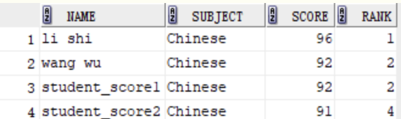
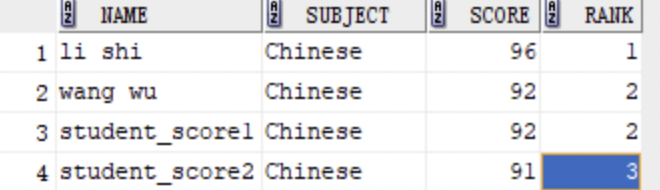
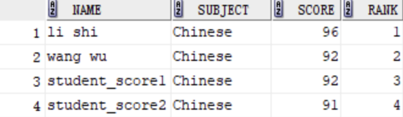

#### MySQL聚簇索引和非聚簇索引的区别是什么

MySQL索引存储在磁盘中

MySQL的索引类型跟存储引擎是相关的，innodb存储引擎数数据文件跟索引文件全部放在ibd文件中（frm存储的是表结构，ibd存储的是数据文件和索引文件），而myisam的数据文件放在myd文件中（myd存储的是数据文件，myi存储的是索引文件），索引放在myi文件中，区分聚簇索引和非聚簇索引，只要判断数据跟索引是否存在一起。

innodb存储引擎在进行数据插入的时候，数据必须要跟索引放在一起，如果有主键就使用主键，没有主键就是用唯一键，没有唯一键就是用6字节的rowid，因此根数据绑定在一起的就是聚簇索引，而为了避免数据冗余存储，其他的索引的叶子节点中存储的都是聚簇索引的key值，因此innodb中既有聚簇索引和非聚簇索引，而myisam中只有非聚簇索引

#### MySQL索引结构有哪些，各自的优劣是什么

索引的数据结构和具体存储引擎的实现相关，MySQL中使用较多的索引有hash索引，B+树索引，innodb索引实现为B+树，memory存储引擎为hash索引

B+树平衡多叉树，索引时从根节点到叶子节点逐级查找，还可以基于索引的熟悉扫描时，可以利用双向指针快速左右移动

哈希索引就是采用一定的哈希算法，把键值换算成新的哈希值，检索时根据哈希算法直接定位到相应的位置，

如果等值查询，键值唯一的情况下，哈希非常快，只需一次计算就能找到相应的键值，如果键值不唯一，需要先找到键所在的位置，再根据链表进行扫描，直到找到相应的数据

如果是范围查询，原先是有序的键值经过哈希算法之后就可能变成不连续的，就没法利用索引完成范围查询检索了

哈希没法利用索引完成排序，以及like的部分模糊查询

哈希索引也不支持多列联和索引的最左匹配规则

B+树索引的关键字检索效率比较平均，没有B数波动大，有大量重复键的情况下哈希索引需要处理哈希碰撞问题，因此效率很低

#### MySQL中索引的类型有哪些，对数据库的性能的影响

1. 普通索引：允许被索引的数据列包含重复的值
1. 唯一索引：保证数据记录的唯一性
1. 主键索引：唯一标识一条记录
1. 组合索引：多个列值组成一个索引，专门用于组合搜索
1. 全文索引

- 回表
  - 普通索引，建立的B+树的叶子节点是主键值，查找到主键值，再根据主键值去主键所在的B+树查找整行数据，这就叫回表
  - 没有主键值，会根据唯一键，没有唯一键，会根据rowid
- 索引覆盖
  - 
- 索引下推
  - 当查询的sql语句中的条件都是其中某些列的时候，可以根据这些列来创建组合索引
  - 在存储引擎层就根据筛选条件，只读取需要的列到service层（非索引下推，就是把所有数据都读取到内存中，然后根据筛选条件进行筛选）
- 最左匹配原则
  - 从左向右匹配
- 谓词下推
  - 把join或者选择字段的过程往下执行，从存储引擎层就把它筛选过来

索引极大提高数据的查询速度

通过使用索引，可以再查询过程中，使用优化隐藏器，提高系统的性能

但是会降低插入、删除、更新标的速度，执行这些操作的时候，还是操作索引文件

索引需要占物理空间，除了数据表占数据空间之外，每一个索引还要占一定的物理空间，如果建立聚簇索引，需要的空间会更大，非聚簇索引很多，一旦聚簇索引改变，所有的非聚簇索引都会跟着变

#### MySQL执行计划

#### MySQL的隔离级别

四种隔离级别，限定事务内外哪些改变是可见的，哪些改变是不可见的，低级别的隔离一般支持更高的并发处理，并且拥有更低的系统开销

- READ UNCOMMITTED读取未提交内容：这个隔离级别中，所有事务都可以看到未提交事务的执行结果。读取未提交数据，也被称为“脏读”
- READ COMMITTED读取提交内容：大多数数据库的默认级别，满足了隔离的早先简单定义：一个事务开始时，只能看见已经提交事务所做的改变，一个事务从开始到提交前，所做的任何数据改变都是不可见的，除非已经提交。这个隔离界别支持"不可重复读"，意味着用户运行同一个语句两次，看到的结果是不同的
- REPEATABLE READ可重复读：MySQL数据库的默认隔离级别，该级别解决了READ UNCOMMITEED隔离级别导致的问题，它保证同一事物的多个实例在并发读取事物是，会“看到同样的”数据行，会导致“幻读”，innodb和falcon存储引擎通过多版本并发控制机制解决了幻读问题
- SERIALIZABLE可串行化：最高的隔离级别，通过强制事物排序，使事物不可能相互冲突，从而解决幻读问题。简而言之，SERIALIZABLE是在每个读的数据行上枷锁，在这个级别，可能导致大量的超时timeout和竞争，lock connection现象，实际应用很少使用到，如果为了数据的稳定性，需要强制减少并发的化，也可以选择这个隔离级别

1. 脏读：一个事务读取了未提交事务执行过程中的数据。一个事务的操作正在多次修改数据，而事务还未提交的时候，另一个事务读取了数据，就会导致读取的数据并非最终持久化之后的数据，这个数据就是脏读的数据

2. 不可重复读：对于数据库中的某个数据，一个事务执行过程中多次查询返回不同查询结果，是因为在事务执行过程中，数据被其他事务提交修改了

3. 幻读：事务T1批量对一个表中某一列数据的变更，但事务T2对这张表也做了变更，并进行了提交，如果此时，事务T1查看刚刚完成操作的数据，会发现还有变更之前的数据没有修改，而这条数据是T2刚刚提交插入的，这个就是幻读。

   幻读和不可重复读都是读取了另一条已经提交的事务，所不同的是不重复读查询的都是同一个数据项，而幻读针对的是一批数据整体

#### MySQL的主从复制

一个MySQL的数据库的服务器主节点复制到一个或多个从节点。MySQL默认采用异步复制方式，从节点不用一直访问主服务器来更新自己的数据，数据的更新可以在远程连接上进行，从节点可以复制数据库中所有数据库或者特定的数据库或特定的表

#### MySQL主从复制原理

1. master服务器将数据的改变记录二进制binlog日志，当master上的数据发生改变时，则将其改变写入二进制日志中
2. slave服务器会在一定时间间隔内对master二进制日志进行探测其是否发生改变，如果发生改变就开始一个I/OThread请求master二进制事件
3. 同时主节点为每个I/O线程启动一个dump线程，用于向其发送二进制事件，并保存至从节点本地的中继日志中，从节点将启动SQL线程从中继日志中读取二进制日志，在本地重放，使得其数据和主节点的保持一致，最后I/OThread和SQLThread将进入睡眠状态，等待下一次被唤醒

- 从库会生成两个线程，一个I/O线程，一个SQL线程
- I/O线程会去请求主库的binlog，并将得到的binlog写到本地的relay-log（中继日志）文件中
- 主库会生成一个log dump线程用来给从库I/O线程传binlog
- SQL线程，会读取relay log文件中的日志，并解析成sql语句逐一执行

1. master将操作语句录入binlog中，授予slave远程连接的功能（master一定要开启binlog二进制日志功能，为了数据安全考虑，slave也要开启binlog功能）
2. slave开启两个线程：I/O线程和SQL线程，I/O线程去读master的binlog内容到中继日志relay log里，SQL线程负责从relay log日志里，读出binglog内容，并更新到slave的数据库里，保证slave数据和master数据保持一致
3. MySQL复制至少需要两个MySQL的服务
4. master和slave的时间需要同步

具体步骤：

- 从库通过手动执行change master to 语句连接主库，提供（user，password，port），并让从库知道，二进制日志的起点位置（file名，position号）；start slave
- 从库的I/O线程和主库的dump线程建立连接
- 从库根据change master to语句提供的file名和position号，I/O库向主库发起binlog请求
- 主库dump线程根据从库的请求，将本地的binlog以events的方式发送给从库I/O线程
- 从库I/O线程接收binlog events，并存放到本地relay log中，传送过来的信息，会记录到master.info中
- 从库SQL线程应用relay log，并且把应用过的记录到relay-log.info中，默认情况下，已经应用过的relay会自动被清理purge

mysql主从形式：

- 一主一从
- 主主复制
- 一主多从
- 多主一从
- 级联复制

主从同步延迟：MySQL主从复制都是单线程操作，主库对所有DDl和DML产生的日志写进binlog，由于binlog是顺序写入，所以效率很高，slave的sqlThread线程将主库的DDL和DML操作事件在slave里重放，DDL和DML的IO操作是随机的不是顺序的，所以效率比较低，另一方面由于SQLThread也是单线程的，当主库的并发较高时，产生的DML和DDL超过slave的SQLThread处理速度。或者当slave中有大型query语句产生了锁等待，那么延时就产生了

解决方案：

- 业务的持久化实现采用分库架构，mysql服务可平行扩展，分散压力
- 单个库读写分离，一主多从，主写从读，分散压力
- 服务的基础架构在业务和mysql之间加入memcache或者Redis的cache层，降低mysql读压力
- 不同业务的mysql物理上放到不同机器，分散压力
- 使用比主库更好的硬件设备作为slave
- mysql5.7之后使用MTS并行复制技术，永久解决复制延时问题

#### MySQL锁的类型有哪些

- 基于锁的属性分类：共享锁、排他锁
  1. 共享锁：读锁，又称S锁。一个事务为数据加上读锁之后，其他事务只能对该数据加读锁，而不能对数据加写锁，直到所有读锁释放之后其他事务才能对其进行加持写锁。共享锁的特性主要是为了支持并发的读取数据，读取数据的时候不支持修改，避免出现重复读的问题
  2. 排他锁：写锁，又称X锁。当一个事务为数据加上写锁时，其他请求将不能再为数据加任何锁，直到该锁释放之后，其他事务才能对数据进行加锁，排他锁的目的是在数据修改的时候，不允许其他事务同时修改，也不允许其他事务读取，避免出现脏数据和脏读的问题
- 基于锁的粒度分类：行级锁（innodb）、表级锁（innodb、myisam）、页级锁（innodb）、记录锁、间隙锁、临建锁
  1. 表锁：指上锁的时候锁住的是整个表，当下一个事务访问该表的时候，必须等待前一个事务释放了锁才能对表进行访问，特点：粒度大，加锁简单
  2. 行锁：指上锁的时候锁住的是表的某个一行或多行记录，其他事务访问同一张表时，只有被锁住的记录不能方位，其他记录可正常访问，特定：粒度小，加锁比表锁麻烦，不容易冲突，相比表锁支持的并发要高
  3. 记录锁：行锁的一种，记录锁的范围指示表中某一条记录，记录锁是说事务在加锁后锁住的只是表的某一条记录，加了记录锁之后数据可以避免数据在查询的时候被修改的重复读问题，也避免了在修改的事务未提交前被其他事务读取的脏读数据
  4. 页锁：介于行锁和表锁之间的一种锁，表锁速度快，但冲突多，行锁冲突少，但速度慢，所以去了折中的页锁，一次锁定相邻的一组记录，特点：开销和加锁时间，介于行锁和表锁之间，出现死锁；粒度介于表锁和行锁之间，并发度一般
  5. 间隙锁：属于行锁的这一种，间隙锁是在事务加锁后锁住表记录的某一个区间，当表的相邻D之前出现空隙则会形成一个区间，遵循左开右闭原则，范围查询未命中记录，查询条件必须命中索引、间隙锁只会出现在REPEATABLE_READ（重复读）的事务级别中。
  6. ；临键锁：行锁的一种，并且是innodb的行锁默认算法，记录锁和间隙锁的这，临键锁会把查询出来的记录锁住，同时也会把该范围查询内的所有间隙空间也会锁住，再之它会把相邻的下一个区间也会锁住
- 基于锁的状态分类：意向共享锁、意向排他锁

#### MySQL索引的基本原理

1. 为什么要有索引

   一半的应用系统，读写比例10:1左右，而且插入操作和一半更新操作很少出现问题。实际应用中，遇到最多也最容易出问题的是一些复杂的查询操作，加速查询，要用到索引

2. 什么是索引

   索引在MySQL中也叫一种“键”，存储引擎用于快速找到记录的一种数据结构，索引对于良好的吸能非常关键，尤其是当表中的数据量越来越大时，索引对于性能的影响愈发重要。索引优化应该是查询性能优化最有效的手段。索引能将查询性能提高好几个数量级。

3. 索引的原理

   本质都是通过不断缩小想要获取数据的范围来筛选出想要的结果，同时把随机的时间变成顺序的事件

4. 索引的数据结构

   MySQL主要用innodb（B+树）和memory（hash索引）

   Memory表存在内存中，断电会消失，适用于临时表。hash索引查找某一条记录时速度非常快，但因为是hash结构，每个键只对应一个值，而且是以散列方式分布，所以不支持范围查找和排序等功能

   B+树是MySQL用的最频繁的索引数据结构，是innodb和myisam存储引擎模式的索引类型，相对hash索引B+树查找单条记录的速度不如hash索引，但是更适合排序操作，范围查询

   hash类型的索引：查询单条快，范围查询慢

   B+树索引：层数越多，数据量指数级增加

#### MySQL为什么需要主从同步

1. SQL语句需要锁表，导致暂时不能使用读的服务，让主库负责写，从库负责读，这样，即使主库出现了锁表，通过从库，也可以保证正常读。读写分离
2. 做数据的热备。主备，备份，主机挂掉，立马切换到备份机
3. 架构的扩展，业务量越来越大，I/O访问频率越高，单机无法满足，此时需要做多库的存储，降低磁盘I/O访问的频率，提高单个机器的I/O性能。

#### MySQL如何处理慢查询

1. 开启慢查询日志，准确定位到哪个SQL语句出现问题。（设定一个时间做为执行慢的标准）
2. 分析SQL语句，看看是否load额外的数据，可能是查询了多于的行，并且抛弃掉了，可能是加载了许多结果中并不需要的列，对语句进行分析以及重写
3. 分析语句的执行计划，获得其使用索引的情况，之后修改语句或者修改索引，使得语句可以尽可能的命中索引
4. 如果语句的优化已经无法进行，考虑是否表中数据量太大，如果是，可以进行横向或纵向的分表

#### MySQL的调优

#### 面试常考点

- 索引分类

  1. 主键索引
  2. 唯一索引
  3. 普通索引
  4. 全文索引
  5. 组合索引

  - 回表：当使用其他索引的时候叶子节点中并不包含整行的数据值，需要去主键索引中进行数据查找的过程叫回表

  - 覆盖索引：当普通的B+树中包含要查询的所有字段时，可以不用回表，此时称之为覆盖索引

  - 最左匹配原则：适用于组合索引的情况，必须先匹配最左的第一个列，才能继续匹配第二个列。

    如（name,age创建组合索引）where name = ?and age= ?可以匹配，where age=?匹配不到，where name=?可以匹配，where age=? and name=?因为MySQL优化器优化可以匹配，优化器会优化条件顺序

  - 索引下推：

- 锁

- 事务（一系列操作的集合），ACID（原子性（undolog日志），一致性（最重要），隔离性（锁以及多版本并发控制（MVCC）），持久性（redolog））

- 日志：binlog（归属于server层）、undolog和redolog（归属于存储引擎innodb）、relaylog和errorlog（server）、慢日志

- MySQL集群
  - 主从复制 binlog
  - 读写分离 mysql-proxy
  - 分库分表 mycat
  
- MySQL优化

- 存储引擎（innodb、myisam、memory）

#### 存储引擎：不同的表数据文件在磁盘里以不同的组织形式存在

1. innodb存储引擎数据跟索引文件放在一个文件中，myisam放在不同文件中
2. innodb支持事务，myisam不支持
3. innodb支持表锁和行锁，myisam支持表锁
4. innodb有外键，myisam没有外键
5. innodb创建索引的时候key值默认是主键，没有主键就唯一键。没有唯一键就是6字节的rowid。如果一个表中有多个索引，数据仅存储一份，其他索引的叶子节点中存储key

#### MySQL事务

1. 原子性（Atomicity）：undolog，还使用undo log来实现多版本并发控制

   在操作任何数据之前，首先将数据备份到一个地方（这个存储数据备份的就是undo log）。然后进行数据的修改，如果出现了错误或者用户执行了rollback语句，系统利用undolog中的备份将数据恢复到事务开始之前的状态。undolog是逻辑日志。

2. 一致性（Consistency）：通过原子性，持久性，隔离性来实现的

3. 隔离性（Isolation）：读写锁+MVCC（多版本并发控制）

     锁与存储引擎相关，默认情况下myisam表锁（共享锁和独占锁），innodb（共享锁，排他锁。。。，有索引锁行，没有就锁表）

4. 持久性（Durability）：redolog要落盘。WAL write ahead log预写日志

   redolog是新数据的备份。在事务提交前，只要将redolog持久化即可，不需要将数据持久化。当系统崩溃时，虽然数据没有持久化，但redolog已经持久化，系统可以根据redolog的内容，将所有数据恢复到最新的状态

   发生数据修改时，innodb引擎会将记录写到redolog中，并更新内存，此时更新就算是完成了，同时innodb引擎会在合适的时机将记录操作到磁盘中。redolog是固定大小，是循环写到的过程。

   不是逻辑修改，是真实物理修改 

#### 数据更新流程：

1. 执行器先从引擎中找到数据，如果在内存中直接返回，如果不在内存中，查询后返回
2. 执行器拿到数据之后会先修改数据，然后调用引擎接口重新写入数据
3. 引擎将数据更新到内存，同时写数据到redo中，此时处于prepare阶段，并通知执行器执行完成，随时可以操作
4. 执行器生成这个操作的binlog
5. 执行器调用引擎接口的事务提交接口，引擎把刚刚写完的redo改成commit状态，更新完成

#### 为什么主键一般选择自动递增

- 索引的维护过程
- B+树的元素的添加删除都会影响到整颗数的结构，如果是递增，只会在后面添加，不会影响到之前已经建立好的索引结构，页合并、页分裂。分布式就不能自增，要用id生成器

### SQL语句

rank() over：成绩相同的两名是并列

dense_rank()：成绩并列，下一位并不空出所占的名次。[dense：密集的 密集联想连续]
row_number() over: 不考虑是否并列，进行连续排名

Mysql中NULL值与任何值比较永不为真

